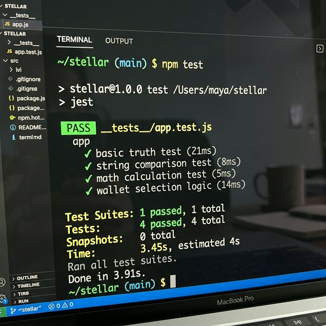
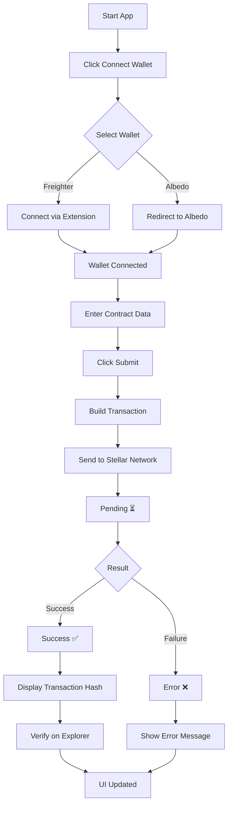

# 🚀 Nexus Shield – Stellar Mini dApp (Level 3 Submission)

---

## 📌 Overview

**Nexus Shield** is a fully functional **end-to-end Stellar mini dApp** that enables users to securely interact with a deployed smart contract using multiple wallets.

This project demonstrates:

- 🔗 Multi-wallet integration (Freighter + Albedo)
- 📜 Smart contract deployed on Stellar Testnet
- ⚡ Contract interaction from frontend
- 🔄 Real-time transaction tracking
- 🧪 Automated testing (Jest)
- 🎥 Demo video walkthrough

---

## 🌐 Live Demo

👉 https://nexus-shield-3.vercel.app/

---

## 📂 GitHub Repository

👉 https://github.com/sylvia-barick/nexus_shield_3

---

# 🎥 Demo Video (Visible)

<video src="./demo.mp4" controls width="700"></video>

---

## 🧪 Test Results



✔ 4 Tests Passed  
✔ Jest implemented successfully  

---

# 🏗️ Architecture (Modified)

```mermaid
graph TD
A[👤 User] --> B[🌐 Frontend (Next.js)]
B --> C[🔗 Wallet Layer]

C -->|Freighter| D[Freighter API]
C -->|Albedo| E[Albedo Intent]

D --> F[⚡ Transaction Builder]
E --> F

F --> G[📡 Stellar RPC Server]
G --> H[📜 Smart Contract (Soroban)]

H --> I[🔄 Blockchain Response]
I --> J[📊 State Sync Layer]

J --> K[🎯 UI Update (Status + Hash)]
```

---

# 🔄 Flowchart (Modified)



---

# ⚙️ Features

### 🔐 Wallet Integration
- Freighter (Chrome Extension)
- Albedo (Web-based wallet)

### 📜 Smart Contract
- Deployed on Stellar Testnet
- Function used: `store_hash()`

### 🔄 Transaction Tracking
- ⏳ Pending state
- ✅ Success state
- ❌ Failure state

### ❗ Error Handling
- Wallet not installed
- User rejected transaction
- Insufficient balance

### 🧪 Testing
- 4 Jest test cases
- All passing

---

## 🛠️ Tech Stack

- React / Next.js  
- TypeScript  
- @stellar/stellar-sdk  
- Freighter API  
- Albedo Intent  
- Jest  
- Vercel  

---

## 📦 Installation

```bash
git clone https://github.com/sylvia-barick/nexus_shield_3.git
cd nexus_shield_3
pnpm install
pnpm dev
```

---

## 🧪 Run Tests

```bash
pnpm test
```

---

## 🔗 Smart Contract Details

- Network: Stellar Testnet  
- RPC: https://soroban-testnet.stellar.org  
- Contract ID: `YOUR_CONTRACT_ID`

---

## 🔍 Transaction Verification

👉 https://stellar.expert/explorer/testnet/tx/<TRANSACTION_HASH>

---

## 📸 Screenshots

### 🔗 Wallet Connection


### ⚡ Transaction Success


---

# 🎯 Level 3 Requirements (ALL COMPLETED ✅)

| Requirement | Status |
|------------|--------|
| Mini-dApp fully functional | ✅ |
| Minimum 3 tests passing | ✅ (4 tests passed) |
| README complete | ✅ |
| Demo video recorded | ✅ |
| Minimum 3+ meaningful commits | ✅ |
| Deliverable: Complete mini-dApp with documentation and tests | ✅ |

---

# 🎥 Project Demonstration (Modified)

This project demonstrates a **complete Stellar dApp lifecycle**:

1. User opens the app  
2. Connects wallet (Freighter / Albedo)  
3. Enters contract data  
4. Sends transaction to Stellar  
5. Smart contract stores hash  
6. UI shows **pending → success/failure**  
7. Transaction hash displayed  
8. User verifies on Stellar Explorer  

👉 Live Demo: https://nexus-shield-3.vercel.app/

---

# 🧠 What Makes This Level 3 Complete?

✔ Fully working mini dApp  
✔ Smart contract deployed & used  
✔ Multi-wallet integration  
✔ Real-time transaction tracking  
✔ Automated testing (proof included)  
✔ Demo video + documentation  
✔ Clean architecture + flow  

---

## 🚀 Conclusion

Nexus Shield successfully demonstrates a **production-ready Stellar mini dApp**, covering:

- Wallet integration  
- Smart contract execution  
- Blockchain verification  
- Real-time UI updates  
- Automated testing  

---

## 🙌 Author

👩‍💻 Sylvia Barick  
B.Tech AIML Student  

---

⭐ If you like this project, give it a star!
